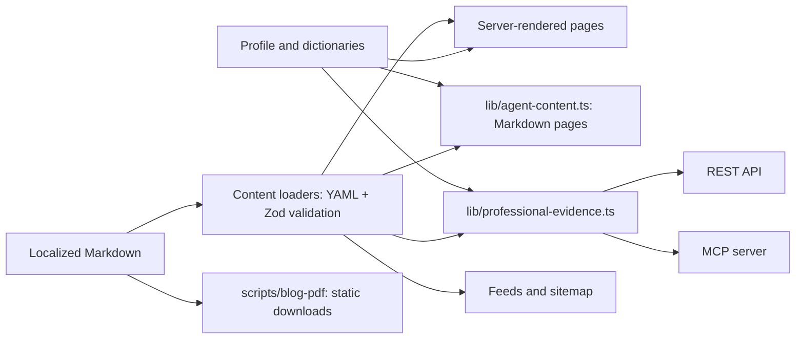

# Architecture and content

[README](../README.md) · [Development](development.md) · [Operations](operations.md)

## Responsibility boundaries

This is one Next.js application with local, versioned content. There is no repository-configured database, CMS, queue, or background job. Keep framework entry points and public assets at their current paths.

| Area                                              | Responsibility and authoritative sources                                                                                               |
| ------------------------------------------------- | -------------------------------------------------------------------------------------------------------------------------------------- |
| [`app/`](../app/)                                 | App Router pages, layouts, route handlers and metadata entry points; `app/styles/` holds styles imported by `app/globals.css`          |
| [`components/`](../components/)                   | Reusable UI, navigation and interactive controls; [design-system guide](../components/design-system/README.md) owns visual conventions |
| [`content/`](../content/)                         | Published blog and project Markdown, grouped by locale                                                                                 |
| [`data/`](../data/)                               | Profile, recommendations and localized dictionaries; `content-index.ts` is a server-only derived slug index                            |
| [`lib/`](../lib/)                                 | Named domain helpers for content, locales, metadata, feeds, evidence and protocols; `devimg-*.generated.ts` files are generated        |
| [`public/`](../public/)                           | Files published at stable URLs, including machine contracts, PDFs, source assets and generated images                                  |
| [`tests/`](../tests/) / [`scripts/`](../scripts/) | Development-only verification and automation; PDF print tooling is outside website bundles                                             |
| [`.agents/skills/`](../.agents/skills/)           | Discovery routers for separate Codex/Antigravity blog-to-PDF and Humanizer variants                                                    |
| [`docs/`](./)                                     | Maintainer guidance, separate from published pages and public API documentation                                                        |

## Content and rendering flow

Pages and layouts render on the server. Locale/detail static parameters allow prerendering, while API handlers and request routing remain server functionality; this is not a static export. `react-markdown` and `remark-gfm` render article bodies. Small client components handle theme/locale controls, navigation, filters and recovery. Essential content and links must work without client JavaScript.

[`lib/content.ts`](../lib/content.ts) reads from the repository root and sorts entries. [`lib/content-source.ts`](../lib/content-source.ts) shares YAML-only parsing and blog validation with the PDF tools. [`next.config.mjs`](../next.config.mjs) includes `content/**/*.md` in server output tracing so deployed handlers can read it. Preserve that inclusion when organizing content.

## Authoring and published assets

Prerequisites: the development environment and existing content tests. Use a corresponding locale file as an example. The project schema in [`lib/content.ts`](../lib/content.ts) and blog schema in [`lib/content-source.ts`](../lib/content-source.ts) are authoritative for fields and defaults.

1. Add or update `content/blog/{locale}/{slug}.md` or `content/projects/{locale}/{slug}.md`. Keep filename, slug and locale metadata consistent with existing entries and indexes. Every blog Markdown file in these directories is published; keep drafts elsewhere.
2. Blog metadata requires title, slug, summary, date, nonempty tags and `lang` matching its directory. Optional cover images require localized alt text. The [PDF workflow](blog-pdfs.md) preserves existing `pdfUrl` paths and generates downloads from the complete article.
3. Project metadata requires title, slug, summary, start date, role, status, tags, stack and highlights. See the schema for optional type/stage, dates, links and cover. [`lib/project-state.ts`](../lib/project-state.ts) controls detail availability: in-progress projects can appear in listings and evidence search while their detail page and project-detail REST/MCP result remain unavailable.
4. Keep localization, linked assets and public professional evidence synchronized. Review HTML, negotiated Markdown, feeds, sitemap, `llms.txt`, REST/OpenAPI and MCP wherever affected. After article, image or print-tool changes, follow the PDF regeneration and review procedure.
5. Run `npm run test:content`, `npm test`, `npm run blog:pdf:check` and `npm run build`; use browser checks when presentation changes. Expected result: valid content, current downloads, reachable supported URLs and equivalent public representations. Investigate schema errors, missing assets and changed PDF hashes before accepting the change.

| Asset kind                      | Location and maintenance                                                                                         |
| ------------------------------- | ---------------------------------------------------------------------------------------------------------------- |
| Image sources                   | `public/projects/`, `public/images/blog/`, `public/seo/`; inline blog SVGs remain directly served                |
| Generated images                | `public/images/generated/{projects,blog,seo}/`; content-hashed outputs owned by [DevImg](devimg.md)              |
| Image manifests and app exports | `public/images/*-manifest.json` and `lib/devimg-*.generated.ts`; regenerate together, never hand-edit            |
| Resume downloads                | `public/downloads/resume.{locale}.pdf`; supplied files, with paths and hashes protected by tests                 |
| Blog downloads                  | `public/downloads/blog/`, produced by `scripts/blog-pdf/`; commit the PDFs with `scripts/blog-pdf/manifest.json` |
| Local artifacts                 | `.devimg/`, `.next/`, `.vercel/`, `output/playwright/`; ignored, not published source                            |

## Localization and request routing

[`lib/site.ts`](../lib/site.ts) owns the canonical origin, `https://www.cleisson.com`. [`lib/i18n.ts`](../lib/i18n.ts) owns `en-US`, `pt-BR`, `es-ES`, the default locale and resume paths. [`data/i18n/`](../data/i18n/) owns localized UI/page copy.

[`proxy.ts`](../proxy.ts) resolves a valid locale cookie, then `Accept-Language`, then the default. `/` rewrites to the selected locale; known unprefixed pages redirect to a locale-prefixed URL. Unsupported locale prefixes recover through the default locale. Unknown pages return a meaningful 404. [`lib/locale-route.ts`](../lib/locale-route.ts) and [`lib/route-availability.ts`](../lib/route-availability.ts) keep locale switching and available routes consistent.

The proxy also negotiates HTML versus Markdown and rewrites explicit `.md` URLs to [`app/api/markdown/[[...path]]/route.ts`](../app/api/markdown/[[...path]]/route.ts). Markdown uses `no-store`. Discovery `Link` headers, `Vary` tokens, 406 responses and the RSC bypass are public contracts covered by agent-readiness tests. `/_next`, `/_vercel`, API and asset traffic have their own routing behavior. The Vercel response-header transform completes `Vary` after Next.js processing; local Next.js cannot exercise that platform transform.

## Public interfaces

| Interface                 | Paths and authority                                                                                                                                                                 |
| ------------------------- | ----------------------------------------------------------------------------------------------------------------------------------------------------------------------------------- |
| Canonical HTML pages      | `/{locale}`, then `/about`, `/contact`, `/privacy`, `/experience`, `/projects`, `/projects/{slug}`, `/blog`, `/blog/{slug}`, `/resume`, `/mcp` under that locale                    |
| Markdown                  | Equivalent canonical pages via `Accept: text/markdown` or `.md`; [`lib/agent-content.ts`](../lib/agent-content.ts)                                                                  |
| REST                      | `/api/v1/profile`, `/api/v1/evidence`, `/api/v1/projects/{slug}`; [`lib/public-api.ts`](../lib/public-api.ts) and [`lib/professional-evidence.ts`](../lib/professional-evidence.ts) |
| MCP                       | `/api/mcp`, with `/mcp` compatibility alias; [`lib/mcp-server.ts`](../lib/mcp-server.ts) uses the same professional evidence                                                        |
| Public API documentation  | `/{locale}/mcp` and Markdown equivalent; [`lib/api-docs.ts`](../lib/api-docs.ts), localized dictionaries and [`public/openapi.json`](../public/openapi.json)                        |
| Agent discovery           | [`public/llms.txt`](../public/llms.txt), HTML metadata and HTTP discovery links                                                                                                     |
| Search/discovery metadata | `/sitemap.xml`, `/robots.txt`, `/manifest.webmanifest`; corresponding `app/` entry points plus [`lib/metadata.ts`](../lib/metadata.ts) and [`lib/schema.ts`](../lib/schema.ts)      |
| Feeds                     | `/rss.xml`, `/atom.xml`, `/feed.json`; [`lib/feed.ts`](../lib/feed.ts) combines locales, handlers set shared caching                                                                |

REST and MCP expose public, source-linked evidence without credentials. MCP adds host/origin validation, bounded bodies and an instance-local rate limiter; provider-wide enforcement is not established by this code. Public API docs and OpenAPI describe supported arguments and errors. Keep those documents at their published paths.
